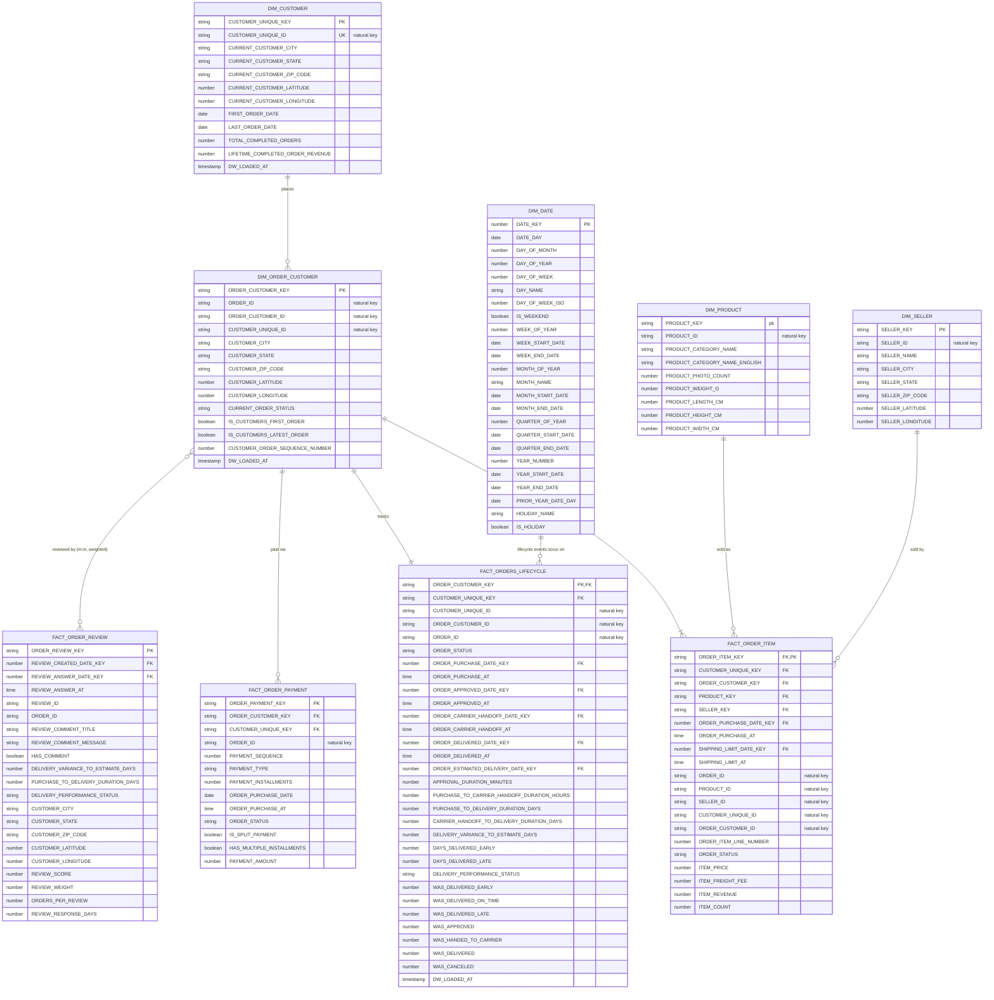

```mermaid
erDiagram
    DIM_CUSTOMER {
        string CUSTOMER_UNIQUE_KEY PK
        string CUSTOMER_UNIQUE_ID UK "natural key"
        string CURRENT_CUSTOMER_CITY
        string CURRENT_CUSTOMER_STATE
        string CURRENT_CUSTOMER_ZIP_CODE
        number CURRENT_CUSTOMER_LATITUDE
        number CURRENT_CUSTOMER_LONGITUDE
        date FIRST_ORDER_DATE
        date LAST_ORDER_DATE
        number TOTAL_COMPLETED_ORDERS
        number LIFETIME_COMPLETED_ORDER_REVENUE
        timestamp DW_LOADED_AT
    }

    DIM_ORDER_CUSTOMER {
        string ORDER_CUSTOMER_KEY PK
        string ORDER_ID "natural key"
        string ORDER_CUSTOMER_ID "natural key"
        string CUSTOMER_UNIQUE_ID "natural key"
        string CUSTOMER_CITY
        string CUSTOMER_STATE
        string CUSTOMER_ZIP_CODE
        number CUSTOMER_LATITUDE
        number CUSTOMER_LONGITUDE
        string CURRENT_ORDER_STATUS
        boolean IS_CUSTOMERS_FIRST_ORDER
        boolean IS_CUSTOMERS_LATEST_ORDER
        number CUSTOMER_ORDER_SEQUENCE_NUMBER
        timestamp DW_LOADED_AT
    }

    DIM_PRODUCT {
        string PRODUCT_KEY pk
        string PRODUCT_ID "natural key"
        string PRODUCT_CATEGORY_NAME
        string PRODUCT_CATEGORY_NAME_ENGLISH
        number PRODUCT_PHOTO_COUNT
        number PRODUCT_WEIGHT_G
        number PRODUCT_LENGTH_CM
        number PRODUCT_HEIGHT_CM
        number PRODUCT_WIDTH_CM
    }

    DIM_SELLER {
        string SELLER_KEY PK
        string SELLER_ID "natural key"
        string SELLER_NAME
        string SELLER_CITY
        string SELLER_STATE
        string SELLER_ZIP_CODE
        number SELLER_LATITUDE
        number SELLER_LONGITUDE
        
    }

    DIM_DATE {
        number DATE_KEY PK
        date DATE_DAY
        number DAY_OF_MONTH
        number DAY_OF_YEAR
        number DAY_OF_WEEK
        string DAY_NAME
        number DAY_OF_WEEK_ISO
        boolean IS_WEEKEND
        number WEEK_OF_YEAR
        date WEEK_START_DATE
        date WEEK_END_DATE
        number MONTH_OF_YEAR
        string MONTH_NAME
        date MONTH_START_DATE
        date MONTH_END_DATE
        number QUARTER_OF_YEAR
        date QUARTER_START_DATE
        date QUARTER_END_DATE
        number YEAR_NUMBER
        date YEAR_START_DATE
        date YEAR_END_DATE
        date PRIOR_YEAR_DATE_DAY
        string HOLIDAY_NAME
        boolean IS_HOLIDAY
    }

    FACT_ORDER_ITEM {
        string ORDER_ITEM_KEY FK,PK
        string CUSTOMER_UNIQUE_KEY FK
        string ORDER_CUSTOMER_KEY FK
        string PRODUCT_KEY FK
        string SELLER_KEY FK
        number ORDER_PURCHASE_DATE_KEY FK
        time ORDER_PURCHASE_AT
        number SHIPPING_LIMIT_DATE_KEY FK
        time SHIPPING_LIMIT_AT
        string ORDER_ID "natural key"
        string PRODUCT_ID "natural key"
        string SELLER_ID "natural key"
        string CUSTOMER_UNIQUE_ID "natural key"
        string ORDER_CUSTOMER_ID "natural key"
        number ORDER_ITEM_LINE_NUMBER
        string ORDER_STATUS
        number ITEM_PRICE
        number ITEM_FREIGHT_FEE
        number ITEM_REVENUE
        number ITEM_COUNT
    }

    FACT_ORDERS_LIFECYCLE {
        string ORDER_CUSTOMER_KEY PK, FK
        string CUSTOMER_UNIQUE_KEY FK
        string CUSTOMER_UNIQUE_ID "natural key"
        string ORDER_CUSTOMER_ID "natural key"
        string ORDER_ID "natural key"
        string ORDER_STATUS
        number ORDER_PURCHASE_DATE_KEY FK
        time ORDER_PURCHASE_AT
        number ORDER_APPROVED_DATE_KEY FK
        time ORDER_APPROVED_AT
        number ORDER_CARRIER_HANDOFF_DATE_KEY FK
        time ORDER_CARRIER_HANDOFF_AT
        number ORDER_DELIVERED_DATE_KEY FK
        time ORDER_DELIVERED_AT
        number ORDER_ESTIMATED_DELIVERY_DATE_KEY FK
        number APPROVAL_DURATION_MINUTES
        number PURCHASE_TO_CARRIER_HANDOFF_DURATION_HOURS
        number PURCHASE_TO_DELIVERY_DURATION_DAYS
        number CARRIER_HANDOFF_TO_DELIVERY_DURATION_DAYS
        number DELIVERY_VARIANCE_TO_ESTIMATE_DAYS
        number DAYS_DELIVERED_EARLY
        number DAYS_DELIVERED_LATE
        string DELIVERY_PERFORMANCE_STATUS
        number WAS_DELIVERED_EARLY
        number WAS_DELIVERED_ON_TIME
        number WAS_DELIVERED_LATE
        number WAS_APPROVED
        number WAS_HANDED_TO_CARRIER
        number WAS_DELIVERED
        number WAS_CANCELED
        timestamp DW_LOADED_AT
    }

    FACT_ORDER_PAYMENT {
        string ORDER_PAYMENT_KEY PK
        string ORDER_CUSTOMER_KEY FK
        string CUSTOMER_UNIQUE_KEY FK
        string ORDER_ID "natural key"
        number PAYMENT_SEQUENCE
        string PAYMENT_TYPE
        number PAYMENT_INSTALLMENTS
        date ORDER_PURCHASE_DATE
        time ORDER_PURCHASE_AT
        string ORDER_STATUS
        boolean IS_SPLIT_PAYMENT
        boolean HAS_MULTIPLE_INSTALLMENTS
        number PAYMENT_AMOUNT
    }

    FACT_ORDER_REVIEW {
        string ORDER_REVIEW_KEY PK
        number REVIEW_CREATED_DATE_KEY FK
        number REVIEW_ANSWER_DATE_KEY FK
        time REVIEW_ANSWER_AT
        string REVIEW_ID
        string ORDER_ID
        string REVIEW_COMMENT_TITLE
        string REVIEW_COMMENT_MESSAGE
        boolean HAS_COMMENT
        number DELIVERY_VARIANCE_TO_ESTIMATE_DAYS
        number PURCHASE_TO_DELIVERY_DURATION_DAYS
        string DELIVERY_PERFORMANCE_STATUS
        string CUSTOMER_CITY
        string CUSTOMER_STATE
        string CUSTOMER_ZIP_CODE
        number CUSTOMER_LATITUDE
        number CUSTOMER_LONGITUDE
        number REVIEW_SCORE
        number REVIEW_WEIGHT
        number ORDERS_PER_REVIEW
        number REVIEW_RESPONSE_DAYS
    }

    DIM_CUSTOMER ||--o{ DIM_ORDER_CUSTOMER : "places"
    DIM_ORDER_CUSTOMER ||--|{ FACT_ORDER_ITEM : "contains"
    DIM_ORDER_CUSTOMER ||--|| FACT_ORDERS_LIFECYCLE : "tracks"
    DIM_ORDER_CUSTOMER ||--o{ FACT_ORDER_PAYMENT : "paid via"
    DIM_ORDER_CUSTOMER }o--o{ FACT_ORDER_REVIEW : "reviewed by (m:m, weighted)"
    DIM_PRODUCT ||--o{ FACT_ORDER_ITEM : "sold as"
    DIM_SELLER ||--o{ FACT_ORDER_ITEM : "sold by"
    DIM_DATE ||--o{ FACT_ORDERS_LIFECYCLE : "lifecycle events occur on"
```